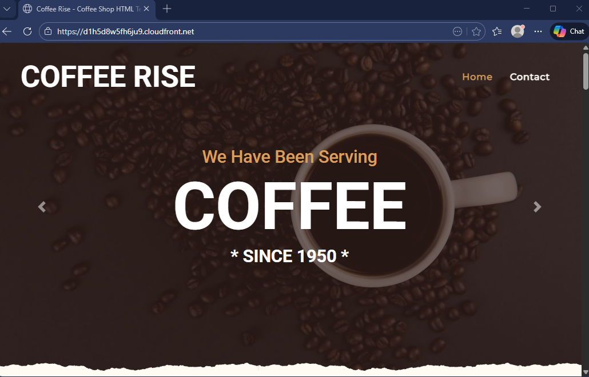
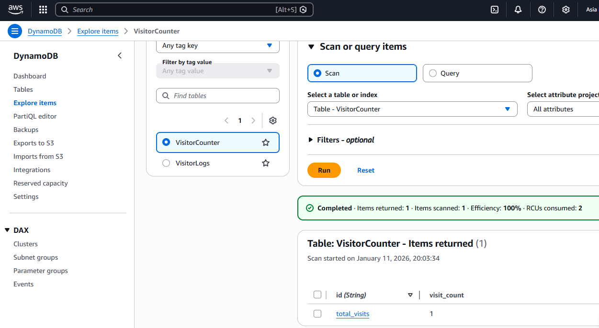
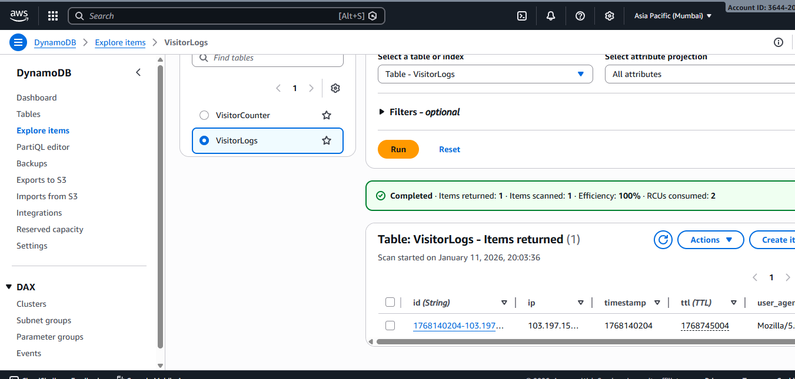

# Coffee Rise - Static Website with Visitor Analytics

[](https://aws.amazon.com/)
[](https://www.terraform.io/)
[](https://github.com/features/actions)


Modern, secure, serverless static website infrastructure with real-time visitor tracking and analytics.

## Screenshots

**Home Page:**


**Visitor Count:**


**Visitor IP and User Agent(Browser):**


## Features

- Static website hosting (S3 + CloudFront)
- **HTTPS** enforced with CloudFront default certificate
- **Origin Access Control (OAC)** — bucket is **not public**
- **WAF v2** protection (CloudFront scope) with:
  - AWS Managed Core Rule Set (CRS)
  - Amazon IP Reputation List
  - Known Bad Inputs protection
  - Rate limiting (2000 req / 5 min per IP)
- Visitor tracking using **Lambda + API Gateway**
- Two DynamoDB tables:
  - `VisitorCounter` → total visits (indefinite retention)
  - `VisitorLogs` → detailed logs with **7-day TTL**
- Client-side deduplication (counts visit only once per 30 days per browser)

## Tech Stack

| Layer             | Technology                              |
|-------------------|-----------------------------------------|
| Frontend Hosting  | AWS S3, CloudFront                      |
| CDN & Security    | CloudFront, WAFv2                       |
| Visitor Tracking  | AWS Lambda, API Gateway, DynamoDB       |
| IaC               | Terraform                               |
| Tracking          | Vanilla JavaScript (Client-side)        |
| CI/CD             | GitHub Actions + OIDC                   |


## Deployment

### Infrastructure (Terraform)

```bash
# 1. Initialize
terraform init

# 2. Plan & review
terraform plan

# 3. Apply
terraform apply --auto-approve
```

After successful deployment you will get (among others):
- CloudFront domain name (e.g. d1234567890.cloudfront.net)
- Distribution ID (e.g. E20RIW5Q8FQGJ2)
- API Gateway tracking endpoint

### Website Content Deployment (GitHub Actions)

Any push to the main branch automatically:

1. Syncs all files to S3 bucket (coffee-rise-website-2026)
2. Creates CloudFront invalidation (/*) → new content visible in ~1–5 minutes

```bash
name: Deploy to S3 & Invalidate CloudFront

on:
  push:
    branches: [ main ]

permissions:
  contents: read
  id-token: write

jobs:
  deploy:
    runs-on: ubuntu-latest
    steps:
      - name: Checkout code
        uses: actions/checkout@v4

      - name: Configure AWS Credentials (OIDC)
        uses: aws-actions/configure-aws-credentials@v4
        with:
          role-to-assume: arn:aws:iam::[Your Account Id]:role/MyGithubRoles
          aws-region: ap-south-1

      - name: Sync to S3
        run: >-
          aws s3 sync . s3://coffee-rise-website-2026 --delete
          --exclude ".git/*"
          --exclude ".github/*"
          --exclude "infra/*"
          --exclude "README.md"
          --exclude "README.MD"
          --exclude "READ-ME"
          --exclude "LICENSE"

      - name: Invalidate CloudFront Cache
        run: |
          aws cloudfront create-invalidation \
            --distribution-id [Your Distribution Id] \
            --paths "/*" \
            --region us-east-1
```
> **_Important:_** Remember to update the **Distribution ID and Account ID!**

### How to Add Visitor Tracking to Your Website

Update visitor-tracker.js:

```js

const VISITOR_KEY = "coffee-rise-last-visited";
const THIRTY_DAYS_MS = 30 * 24 * 60 * 60 * 1000; // 30 days

function shouldCountVisit() {
    const lastVisit = localStorage.getItem(VISITOR_KEY);

    // First time visitor
    if (!lastVisit) {
        return true;
    }

    const lastVisitTime = parseInt(lastVisit, 10);
    const now = Date.now();

    // More than 30 days passed → count as new visit
    return (now - lastVisitTime > THIRTY_DAYS_MS);
}

// Only track if conditions are met
if (shouldCountVisit()) {
    fetch("[API Gateway endpoint]/track", {
        method: "GET",
        mode: "no-cors",
        cache: "no-store"
    }).catch(() => {}); // silent fail

    // Update last visit time
    localStorage.setItem(VISITOR_KEY, Date.now().toString());
}

```
> **_Important:_** Remember to replace the URL with your real **API Gateway endpoint!**

## Security Highlights

- S3 bucket never public
- Only CloudFront can read content (via OAC + bucket policy)
- WAF protects against common attacks + rate limiting
- All traffic HTTPS
- S3 server-side encryption + versioning enabled

## Next Steps / Ideas

- Add custom domain + free ACM certificate
- Create simple visitor dashboard (QuickSight / Amplify / static page)
- Add country-level stats (GeoIP in Lambda)
- Improve bot filtering

## CleanUp

- Empty the s3 bucket manually.
- Run:
```bash
terraform destroy --auto-approve
```

---

Made with ☕ in 2026! 
Best Of Luck! 🚀

